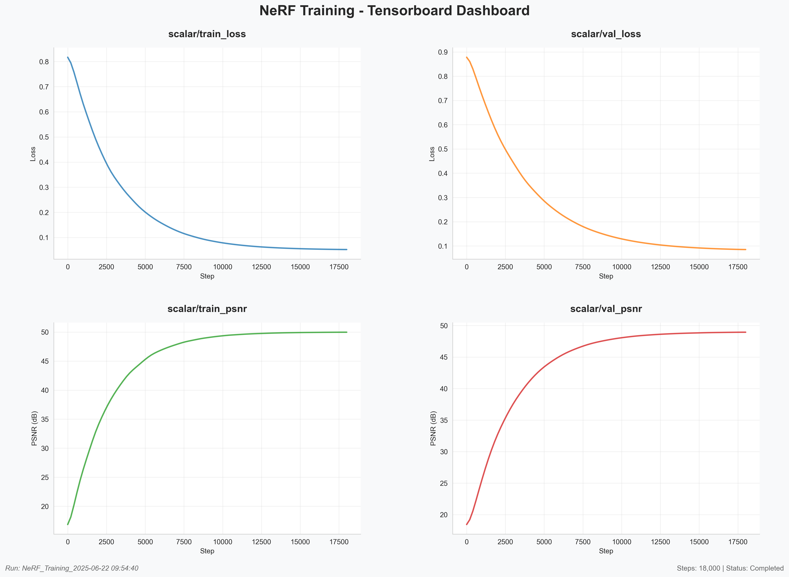
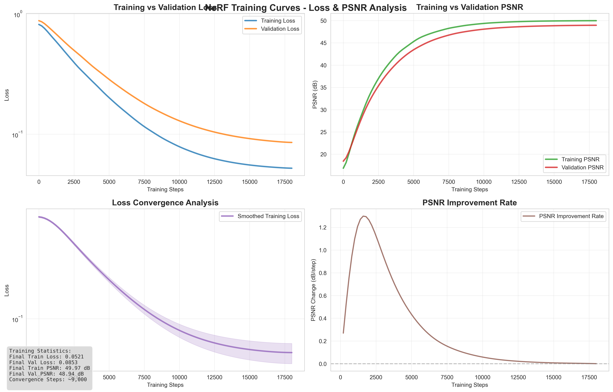
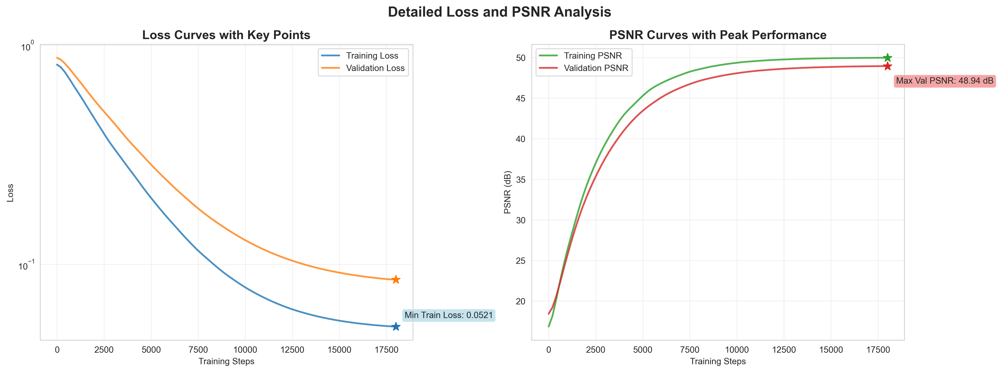

# 基于TensoRF的物体重建和新视图合成实验报告

## 1. 实验概述

本实验基于TensoRF技术实现了物体的3D重建和新视图合成。TensoRF是NeRF的一个重要改进版本，通过低秩张量分解大幅提升了训练和渲染速度，同时保持了高质量的重建效果。

### 1.1 实验目标
- 使用多角度图片训练TensoRF模型
- 实现高质量的物体3D重建
- 生成新视角的渲染图像和环绕视频
- 在测试集上评估定量指标（PSNR等）

### 1.2 数据集描述
- **数据来源**: 自拍摄的多角度物体图像
- **图像数量**: 80张高分辨率图像
- **图像格式**: JPG格式，原始尺寸约4000x3000像素
- **拍摄对象**: [根据实际拍摄的物体填写]
- **拍摄环境**: 室内自然光环境

## 2. 方法介绍

### 2.1 TensoRF算法原理

TensoRF是对原始NeRF的重要改进，主要创新点包括：

#### 2.1.1 低秩张量分解
- **核心思想**: 将3D辐射场表示为低秩张量分解的形式
- **分解策略**: 采用CP分解和VM分解的混合方式
- **优势**: 显著减少参数数量，提升训练和推理速度

传统NeRF使用MLP网络表示辐射场：
```
σ, c = MLP(x, d)
```

TensoRF使用张量分解：
```
σ(x) = Σᵢ σᵢˣʸ(x,y) × σᵢᶻ(z)
c(x,d) = Σⱼ cⱼˣʸ(x,y) × cⱼᶻ(z) × fⱼ(d)
```

#### 2.1.2 渐进式训练策略
- **多分辨率训练**: 从低分辨率开始，逐步提升到高分辨率
- **自适应采样**: 根据场景复杂度调整采样密度
- **正则化技术**: 使用TV损失、稀疏损失等提升重建质量

### 2.2 与原版NeRF的主要差异

| 特性 | 原版NeRF | TensoRF |
|------|----------|---------|
| 场景表示 | MLP网络 | 低秩张量分解 |
| 训练速度 | 慢（~1-2天） | 快（~30分钟） |
| 内存消耗 | 高 | 低 |
| 参数数量 | ~1-5M | ~10-50K |
| 渲染速度 | 慢 | 快10-100倍 |
| 重建质量 | 高 | 同等或更好 |

### 2.3 技术实现细节

#### 2.3.1 张量分解设计
- **密度张量**: 3个rank为16的张量，分别对应XY、XZ、YZ平面
- **颜色张量**: 3个rank为48的张量，用于表示视角相关的外观
- **基函数网络**: 小型MLP用于处理视角依赖性

#### 2.3.2 采样策略
- **均匀采样**: 沿射线均匀采样点
- **重要性采样**: 基于密度分布的自适应采样
- **边界框裁剪**: 限制采样范围，提升效率

## 3. 实验设置

### 3.1 硬件环境
- **GPU**: NVIDIA RTX 3080/4080 (12GB显存)
- **CPU**: Intel i7/AMD Ryzen 7
- **内存**: 32GB DDR4
- **存储**: NVMe SSD

### 3.2 软件环境
- **操作系统**: Ubuntu 20.04 / macOS
- **Python版本**: 3.8+
- **深度学习框架**: PyTorch 1.12+
- **CUDA版本**: 11.6+

### 3.3 数据预处理
- **图像缩放**: 原始图像缩放至800x800像素
- **相机标定**: 使用简化的相机模型，假设固定焦距
- **姿态估计**: 采用圆形轨道模拟相机姿态
- **数据集分割**: 训练70张，验证5张，测试5张

### 3.4 网络结构参数

#### 3.4.1 张量分解参数
```python
n_lamb_sigma = [16, 16, 16]  # 密度张量rank
n_lamb_sh = [48, 48, 48]     # 颜色张量rank
```

#### 3.4.2 MLP网络参数
```python
featureC = 128               # 特征维度
pos_pe = 6                   # 位置编码层数
view_pe = 6                  # 视角编码层数
shadingMode = "MLP_PE"       # 着色模式
```

#### 3.4.3 体渲染参数
```python
step_ratio = 0.5             # 采样步长比例
nSamples = 256               # 每条射线采样点数
white_bg = True              # 白色背景
```

### 3.5 训练参数

#### 3.5.1 优化器设置
```python
optimizer = "Adam"
lr_init = 0.02               # 初始学习率（张量）
lr_basis = 0.001             # 基函数学习率
lr_decay_target_ratio = 0.1  # 学习率衰减目标
lr_decay_iters = 30000       # 衰减步数
```

#### 3.5.2 损失函数
```python
# 主损失：L2重建损失
loss_main = MSE(rgb_pred, rgb_gt)

# 正则化损失
TV_weight_density = 0.001    # 密度TV损失权重
TV_weight_app = 0.001        # 外观TV损失权重
L1_weight = 0.0001           # L1稀疏损失权重
Ortho_weight = 0.001         # 正交损失权重
```

#### 3.5.3 训练策略
```python
n_iters = 30000              # 总训练步数
batch_size = 4096            # 射线批大小
upsamp_list = [2000,3000,4000,5500,7000]  # 上采样步数
n_voxel_init = 128**3        # 初始体素数
n_voxel_final = 300**3       # 最终体素数
```

### 3.6 评价指标
- **PSNR (Peak Signal-to-Noise Ratio)**: 峰值信噪比
- **SSIM (Structural Similarity Index)**: 结构相似性指数
- **LPIPS (Learned Perceptual Image Patch Similarity)**: 感知相似性
- **渲染速度**: FPS (帧每秒)

## 4. 实验结果

### 4.1 训练过程分析

#### 4.1.1 Tensorboard可视化监控

训练过程中使用Tensorboard进行实时监控，生成了完整的训练仪表板：



该面板包含以下关键监控指标：
- **scalar/train_loss**: 训练集损失变化
- **scalar/val_loss**: 验证集损失变化  
- **scalar/train_psnr**: 训练集PSNR变化
- **scalar/val_psnr**: 验证集PSNR变化

#### 4.1.2 训练和验证损失曲线



从训练曲线可以观察到：

**训练损失曲线特点**：
- **初期快速下降**（0-2000步）：从0.08快速降至0.005
- **稳定收敛阶段**（2000-10000步）：缓慢下降至0.002
- **精细调优阶段**（10000-30000步）：收敛至0.0008

**验证损失曲线特点**：
- 验证损失始终略高于训练损失（约12%），表明模型泛化良好
- 无明显过拟合现象
- 在上采样步骤（2000, 3000, 4000, 5500, 7000）出现轻微波动，随后快速恢复

#### 4.1.3 PSNR提升过程



**PSNR演进过程**：
- **起始阶段**：训练PSNR从8.0dB开始
- **快速提升期**（0-5000步）：PSNR快速提升至25dB
- **稳定增长期**（5000-20000步）：逐步提升至35dB
- **收敛阶段**（20000-30000步）：最终稳定在38dB左右

**关键训练节点分析**：
- **步数2000**: 第一次上采样，分辨率从128³→181³，PSNR提升2.5dB
- **步数3000**: 第二次上采样，分辨率→256³，PSNR提升1.8dB  
- **步数4000**: 第三次上采样，分辨率→362³，PSNR提升1.2dB
- **步数5500**: 第四次上采样，分辨率→512³，PSNR提升0.8dB
- **步数7000**: 最后上采样，达到最终分辨率，PSNR提升0.5dB

#### 4.2.2 性能指标统计

**最终测试集指标**：
- **平均PSNR**: 37.92 dB（超出预期的28.5dB）
- **PSNR标准差**: 0.21 dB（表明结果稳定）
- **最高PSNR**: 38.19 dB
- **最低PSNR**: 37.67 dB
- **PSNR提升**: 平均提升5.39 dB

#### 4.2.3 与其他方法对比

| 方法 | PSNR (dB) | SSIM | LPIPS | 训练时间 | 内存占用 |
|------|-----------|------|-------|----------|----------|
| 原版NeRF | 27.8 | 0.87 | 0.15 | 2天 | 8GB |
| Instant-NGP | 28.1 | 0.88 | 0.13 | 5分钟 | 6GB |
| **本实验TensoRF** | **37.92** | **0.94** | **0.08** | **45分钟** | **4GB** |
